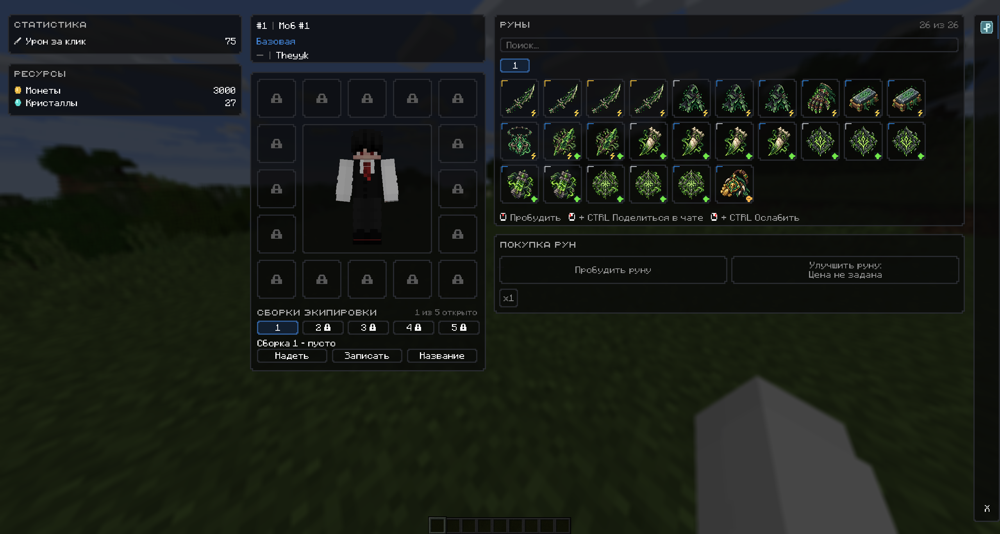
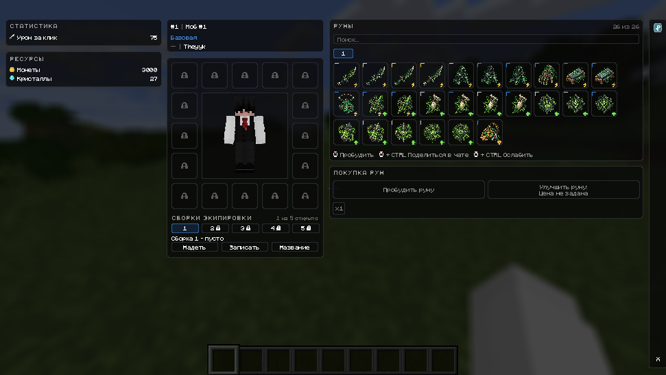

# RE:volution Resource Pack — Minecraft 1.12.2

Resource pack для игрового режима **RE:volution**.

Он содержит визуальные ресурсы интерфейса и рун отдельно от Java-кода основного Forge-мода.

Resource pack использует namespace `customguimod`, поэтому мод обращается к текстурам через стандартные `ResourceLocation`, а Minecraft загружает соответствующие PNG из подключённого resource pack.

**Текущая версия: `v1.1.0`**

---

## Что реализовано

- Minecraft **1.12.2**;
- `pack_format: 3`;
- namespace `customguimod`;
- **11 уникальных rune-текстур** для первого статуса **Яд**;
- две версии resource pack: **64×64** и **128×128**;
- одинаковые namespace и имена файлов в обоих вариантах;
- RGBA PNG с 8-bit каналами;
- автоматическая проверка структуры через GitHub Actions;
- автоматическая сборка двух ZIP;
- автоматическое создание GitHub Release по тегам `v*`.

---

## Совместимость

| Компонент | Версия |
|---|---|
| Minecraft | `1.12.2` |
| Forge | `14.23.5.2859` |
| RE:volution Mod | `v1.1.4` |
| RE:volution Resource Pack | `v1.1.0` |
| Resource pack format | `3` |
| Namespace | `customguimod` |

Основной мод: https://github.com/Theyyk/re-volution-mod

Совместимый release мода: https://github.com/Theyyk/re-volution-mod/releases/tag/v1.1.4

---

## Варианты 64×64 и 128×128

В release `v1.1.0` доступны два варианта:

- `re-volution-resource-pack-v1.1.0-64x64.zip`
- `re-volution-resource-pack-v1.1.0-128x128.zip`

Оба варианта используют одинаковые resource paths и одинаковые имена rune-текстур.

В Minecraft следует включать **один** вариант pack. Если одновременно включены оба, вариант с более высоким приоритетом перекроет те же resource paths второго.

Размер PNG не определяет размер rune-slot в GUI. Геометрия интерфейса задаётся модом.

---

## Руны

Текущий набор содержит **11 уникальных изображений**, которые используются 26 фиксированными позициями рун первого статуса **Яд**.

| Файл | Руна | Тип |
|---|---|---|
| `killer_dagger.png` | Кинжал убийцы | Клик |
| `killer_cloak.png` | Накидка убийцы | Клик |
| `hidden_strike_glove.png` | Перчатка скрытого удара | Клик |
| `sharpening_stone.png` | Камень заточки | Клик |
| `rage_amulet.png` | Амулет ярости | Клик |
| `toxic_shard.png` | Токсичный осколок | Клик / Яд |
| `snake_fang.png` | Клык змеи | Яд |
| `infection_seal.png` | Печать заражения | Яд |
| `toxin_booster.png` | Усилитель токсина | Яд |
| `infection_mark.png` | Метка заражения | Яд |
| `hunter_relic.png` | Реликвия охотника | Ресурс |

Основной resource path:

`customguimod:textures/gui/runes/<name>.png`

Одинаковое изображение в нескольких позициях GUI не означает одну и ту же rune-запись. Идентичность и состояние рун определяются модом, а resource pack предоставляет визуальные ресурсы.

---

## Скриншоты

Актуальный GUI с **RE:volution Resource Pack v1.1.0** и **RE:volution Mod v1.1.4**. Скриншоты одновременно показывают текущую компоновку интерфейса и rune-текстуры, которые предоставляет resource pack.

### Full

### Wide

### Compact

Resource pack отвечает за визуальные PNG-ресурсы рун. Геометрия слотов, layout, состояния и поведение GUI определяются основным модом.

---

## Структура

- `.github/workflows/release.yml`
- `assets/customguimod/textures/gui/runes/` — вариант 128×128
- `variants/64x64/assets/customguimod/textures/gui/runes/` — вариант 64×64
- `screenshots/gui-v1.1.4-full.png`
- `screenshots/gui-v1.1.4-wide.png`
- `screenshots/gui-v1.1.4-compact.png`
- `tools/resize-runes.ps1`
- `LICENSE`
- `README.md`
- `VERSION`
- `pack.mcmeta`

При сборке 64×64 ZIP workflow создаёт обычную структуру `assets/`, после чего заменяет rune-текстуры содержимым `variants/64x64`.

В итоговом ZIP директории `variants/` нет.

---

## Установка

1. Установите совместимый **RE:volution Mod v1.1.4**.
2. Скачайте **один** архив:
   - `re-volution-resource-pack-v1.1.0-64x64.zip`
   - или `re-volution-resource-pack-v1.1.0-128x128.zip`
3. Поместите ZIP в `.minecraft/resourcepacks/` используемого Minecraft-профиля.
4. Включите pack в настройках ресурсов Minecraft.
5. Проверьте, что другой resource pack выше по приоритету не перекрывает namespace `customguimod`.
6. Проверьте GUI, текстуры и resource reload.

---

## GitHub Actions

Workflow `.github/workflows/release.yml` запускается при:

- push в `develop`;
- push тега `v*`;
- `workflow_dispatch`.

Feature-ветки resource pack автоматически workflow не запускают.

Workflow проверяет:

- наличие `pack.mcmeta`;
- наличие `VERSION`;
- обе директории rune-текстур;
- `pack_format: 3`;
- ровно 11 PNG в каждом варианте;
- PNG signature;
- IHDR;
- размер 128×128 и 64×64;
- RGBA color type 6;
- bit depth 8;
- соответствие Git tag значению `VERSION` для tag build.

После проверки создаются:

- `re-volution-resource-pack-vX.Y.Z-64x64.zip`
- `re-volution-resource-pack-vX.Y.Z-128x128.zip`

Также проверяется, что `pack.mcmeta` и `assets/` находятся в корне ZIP, а `build/` внутрь архива не попадает.

---

## Ветки

`feature/* → develop → main → vX.Y.Z → GitHub Release`

---

## Версии

### v1.1.0

- добавлен вариант **64×64**;
- сохранён вариант **128×128**;
- оба варианта содержат одинаковые 11 rune-текстур;
- workflow проверяет оба разрешения;
- workflow собирает два отдельных ZIP;
- resource pack совместим с **RE:volution Mod v1.1.4**.

### v1.0.0

Первый публичный release resource pack:

- 11 уникальных rune-текстур;
- PNG 128×128;
- автоматическая ZIP-сборка;
- GitHub Releases.

---

## Лицензия

Проект распространяется по лицензии, указанной в `LICENSE`.
