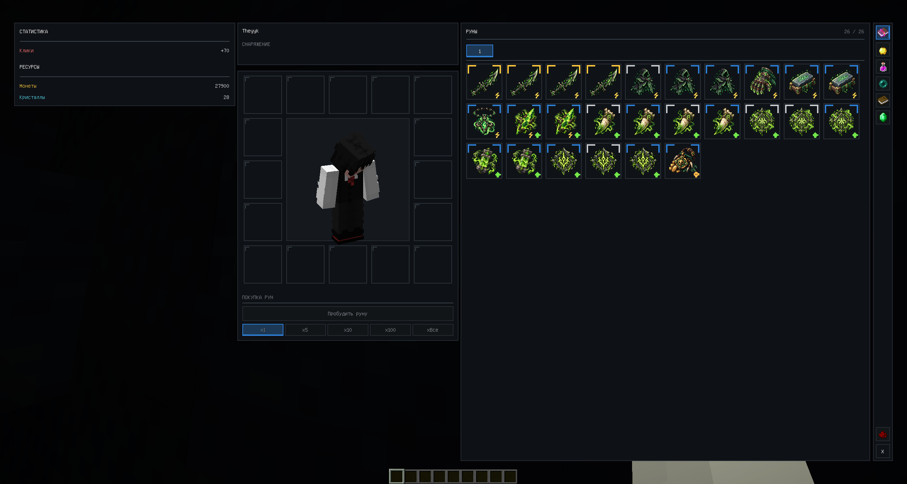
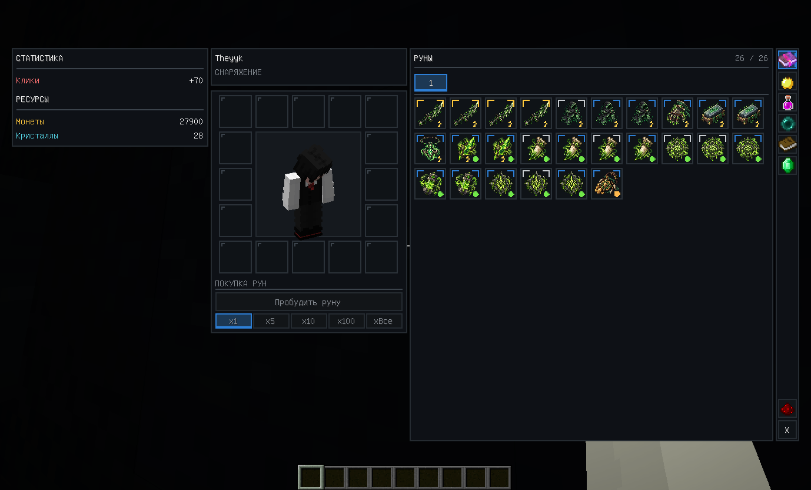
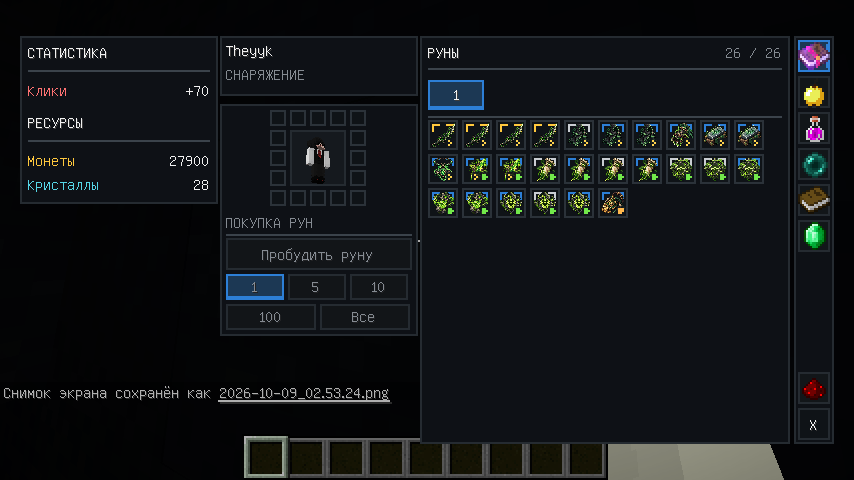

# RE:volution Resource Pack — Minecraft 1.12.2

Ресурс-пак для игрового режима **RE:volution**, содержащий визуальные ассеты интерфейса и рун отдельно от кода основного Forge-мода.

Пак использует тот же namespace `customguimod`, поэтому мод обращается к текстурам через обычные `ResourceLocation`, а Minecraft подменяет их ресурсами из подключённого resource pack.

**Текущая версия: `v1.0.0`**

---

## 🎯 Что реализовано

- отдельный репозиторий для визуальных ассетов RE:volution;
- совместимость с Minecraft 1.12.2 и `pack_format: 3`;
- набор из **11 уникальных текстур рун** для статуса **Яд**;
- единый формат игровых иконок `128x128`;
- прозрачный фон PNG;
- оптимизация исходных изображений без изменения игровых размеров отображения;
- автоматическая проверка структуры resource pack через GitHub Actions;
- автоматическая сборка готового ZIP;
- автоматическое создание GitHub Release по тегам `v*`;
- отдельные ветки `main`, `develop` и `feature/*` по той же схеме, что и у основного мода.

---

## 🛠️ Совместимость

| Компонент | Значение |
|---|---|
| Minecraft | 1.12.2 |
| Forge | 1.12.2 |
| Resource pack format | 3 |
| Namespace | `customguimod` |
| Формат изображений | PNG |
| Размер игровых иконок рун | `128x128` |

Основной проект: [re-volution-mod](https://github.com/Theyyk/re-volution-mod)

---

## ✨ Руны и GUI

Текстуры рун хранятся отдельно от Java-кода и загружаются Minecraft через стандартную систему ресурсов.

Текущий набор содержит 11 уникальных изображений, которые используются 26 фиксированными позициями рун в основном моде.

| Файл | Руна | Тип |
|---|---|---|
| `killer_dagger.png` | Кинжал убийцы | Клик |
| `killer_cloak.png` | Накидка убийцы | Клик |
| `hidden_strike_glove.png` | Перчатка скрытого удара | Клик |
| `sharpening_stone.png` | Камень заточки | Клик |
| `rage_amulet.png` | Амулет ярости | Клик |
| `toxic_shard.png` | Токсичный осколок | Клик / Яд |
| `snake_fang.png` | Клык змеи | Яд |
| `infection_seal.png` | Печать заражения | Яд |
| `toxin_booster.png` | Усилитель токсина | Яд |
| `infection_mark.png` | Метка заражения | Яд |
| `hunter_relic.png` | Реликвия охотника | Ресурс |

Визуальный стиль набора: тёмные серые и чёрные оттенки, приглушённый зелёный, серебро и редкие золотистые акценты. Иконка отвечает только за основной предмет; ранг, тип и состояние слота рисуются интерфейсом отдельно.

### Скриншоты интеграции

Актуальные скриншоты хранятся прямо в этом репозитории и показывают текущий набор рун статуса **Яд** с resource-pack текстурами.

#### Полный интерфейс



#### Широкий интерфейс



#### Компактный интерфейс



---

## 📁 Структура

```text
re-volution-resource-pack/
├─ .github/
│  └─ workflows/
│     └─ release.yml
├─ assets/
│  └─ customguimod/
│     └─ textures/
│        └─ gui/
│           └─ runes/
├─ docs/
├─ screenshots/
│  ├─ gui-poison-runes-full.png
│  ├─ gui-poison-runes-wide.png
│  └─ gui-poison-runes-compact.png
├─ tools/
│  └─ resize-runes.ps1
├─ LICENSE
├─ README.md
├─ VERSION
└─ pack.mcmeta
```

Текущие rune-ассеты находятся в:

```text
assets/customguimod/textures/gui/runes/
```

По мере развития GUI сюда планируется вынести и другие визуальные категории:

```text
ranks/
status/
types/
buttons/
backgrounds/
```

---

## 🧩 Разделение мода и resource pack

Архитектура проекта разделяет игровую логику и визуалы.

```text
re-volution-mod
├─ Java-логика
├─ GUI-логика
├─ состояние игрока
├─ сеть
├─ MongoDB
└─ ResourceLocation
        ↓
re-volution-resource-pack
└─ PNG-текстуры
```

Мод не должен декодировать PNG вручную во время рендера. Minecraft TextureManager отвечает за загрузку текстур, а клиентский preloader заранее прогревает используемые rune-текстуры после загрузки ресурсов.

---

## ⚡ Оптимизация изображений

Первоначальные rune-ассеты были значительно больше необходимого игрового разрешения.

После нормализации всех 11 файлов до `128x128` общий размер набора уменьшился примерно:

```text
12.1 MiB -> 0.27 MiB
```

Экономия составляет около **97.7%**.

Для повторной нормализации используется:

```powershell
powershell -ExecutionPolicy Bypass -File ".\tools\resize-runes.ps1"
```

Изменённые изображения всегда следует визуально проверять в Minecraft перед релизом.

---

## 📥 Установка

1. Откройте раздел [Releases](https://github.com/Theyyk/re-volution-resource-pack/releases).
2. Скачайте архив вида `re-volution-resource-pack-vX.Y.Z.zip`.
3. Поместите ZIP в папку Minecraft:

```text
.minecraft/resourcepacks/
```

4. Включите **RE:volution Resource Pack** в настройках ресурсов Minecraft.

Для разработки можно также использовать распакованную папку resource pack.

---

## 📦 Сборка и релизы

GitHub Actions проверяет:

- наличие `pack.mcmeta`;
- наличие namespace `assets/customguimod`;
- `pack_format: 3`;
- соответствие тега значению из `VERSION` для релизных запусков.

Для каждого запуска workflow собирается ZIP, в корне которого находятся:

```text
pack.mcmeta
assets/
```

Если существует `pack.png`, он также автоматически включается в архив.

При push тега вида:

```text
v1.0.0
```

workflow автоматически создаёт GitHub Release и прикладывает готовый ZIP.

---

## 🌿 Ветки

Используется та же модель разработки, что и в основном моде:

```text
main       стабильные релизы
develop    интеграционная разработка
feature/*  отдельные задачи
```

Релизный тег ставится только на проверенное состояние `main`.

---

## 📌 Версии

### v1.0.0

Первый публичный релиз resource pack:

- 11 уникальных rune-текстур;
- визуальный набор статуса Яд;
- нормализация изображений до `128x128`;
- уменьшение размера набора примерно на 97.7%;
- автоматическая сборка ZIP;
- автоматические GitHub Releases;
- ветки `main`, `develop` и `feature/*`.

---

## 🗺️ Дальнейшее развитие

Планируется постепенно вынести из мода оставшиеся чисто визуальные элементы GUI:

- рамки рангов;
- значки статусов;
- значки типов;
- кнопки;
- фоны и панели;
- дополнительные UI-атласы.

Игровая логика, состояние и сетевой код при этом остаются в [re-volution-mod](https://github.com/Theyyk/re-volution-mod).

---

## 📄 Лицензия

Проект распространяется по лицензии MIT. Подробности находятся в файле [LICENSE](LICENSE).
